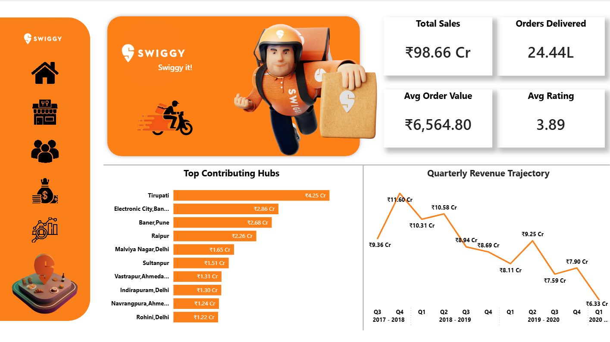

# 🛵 Swiggy Enterprise Performance & Market Dynamics Dashboard

## 📊 Project Overview
This repository contains an interactive, enterprise-grade **Performance & Market Dynamics Dashboard** built entirely in Power BI. The project analyzes a multi-year food delivery dataset from Swiggy to evaluate regional revenue velocity, uncover macro temporal trends, dissect payment ecosystem distributions, and identify core consumer demographic segments. 

The primary objective of this analysis is to transform raw transactional logs into actionable business strategies, providing corporate stakeholders and C-suite executives with the insights necessary to optimize supply chain logistics and maximize regional market share.

---

## 🛠️ Tech Stack & Architecture
* **Data Processing:** Power Query (Advanced ETL pipelines, type casting, schema transformation)
* **Data Modeling:** Power Pivot / Data Model (Star schema configuration, normalized fact and dimension tables)
* **Analytics Engine:** Advanced Data Analysis Expressions (DAX) for explicit custom measures, metrics, and time-intelligence tracking
* **Visualization Interface:** Dynamic multi-slicers (Temporal, Category, Segment), overlapping multi-year trend lines, localized geospatial heat mapping, and custom category distribution donut charts.

---

## 🖥️ Dashboard Interface Layout

The interactive user interface is structurally divided into four core areas to enable seamless data drilling:

1. **Executive KPIs:** Real-time tracking of Total Revenue, Total Orders, and Average Order Value (AOV).
2. **Temporal Cyclicality:** An overlapping seasonal line graph grouping quarterly performance over multiple fiscal years to isolate pure cyclical variations.
3. **Product & Demographic Analytics:** Side-by-side breakdowns of food profile sales (Non-Veg vs. Veg) alongside spending weights grouped by gender and age-slab matrix cohorts.
4. **Geographical Distribution:** An integrated Indian micro-market map displaying localized delivery order density at a glance.



---

## 📌 Framework & Structural Localization

Unlike baseline international templates, this analytics engine is custom-built to align natively with Indian corporate accounting standards and domestic market behaviors:

### 1. Indian Financial Calendar Alignment
All time-series visualizations, historical regressions, and chronological trend models strictly operate on the **Indian Fiscal Year (1st April to 31st March)**:
* **Quarter 1 (Q1):** April – June *(Monsoon Entry & Delivery Structural Adjustments)*
* **Quarter 2 (Q2):** July – September *(Monsoon Highs & Recurring Demand Peaks)*
* **Quarter 3 (Q3):** October – December *(Peak Festive Surge: Diwali, Dussehra, Year-End)*
* **Quarter 4 (Q4):** January – March *(Fiscal Closures, Corporate Audits, & Post-Festive Stabilization)*

### 2. Indian Numbering System Denomination
To ensure direct, instant scannability for corporate boardrooms and domestic stakeholders, all financial metrics and summary cards abandon Western millions/billions. Everything is dynamically computed using the **Indian Numbering System (₹, Lakhs, Crores)**:
* Currency format standard applied: `₹ ##,##,##,###.##`

---

## 💡 Executive Insights & Strategic Recommendations

### 1. Systemic Macro Revenue Contraction
* **The Finding:** The platform peaked over two fiscal cycles ago during **Q4 FY 2017–18 at ₹11.60 Cr**. Since that peak, the platform has faced a structural downward trajectory, hitting an all-time operational low of **₹6.33 Cr in Q1 FY 2020–21**. This indicates structural churn or aggressive competitor penetration that requires urgent marketing intervention.
* **CEO Strategy:** Implement aggressive customer win-back campaigns and re-evaluate competitor pricing structures. Establish strict retention programs targeting accounts that showed high engagement levels prior to the contraction period.

### 2. The Electronic City Counter-Trend Anomaly
* **The Finding:** While aggregate national markets suffered a continuous downward revenue trajectory, **Electronic City (Bangalore) exhibited an aggressive counter-trend hyper-surge in Q3 FY 2019–20**. This rapid expansion successfully vaulted the micro-market to **India's #2 highest revenue-generating sector nationwide**.
* **CEO Strategy:** Immediately redirect underutilized delivery fleet resources and localized performance marketing spend to Electronic City, Bangalore. Secure high-density corporate partnership exclusivity to lock down this hyper-growth sanctuary and maintain strict delivery SLAs.

### 3. Macro Cyclicality & Q2 Seasonal Peaks
* **The Finding:** The platform exhibits robust, predictable **Q2 seasonality**. Across all major active years, Q2 consistently undergoes a significant revenue spike (e.g., reaching **₹10.58 Cr in FY 2018–19** and **₹9.25 Cr in FY 2019–20**), consistently outperforming its adjacent quarters (Q1 and Q3). 
* **CEO Strategy:** Mitigate the Q1 monsoon slack by building targeted pre-monsoon corporate meal subscriptions and high-value indoor family delivery promotions. This flattens out the seasonal revenue troughs before entering the high-velocity Q2 demand window.

### 4. Demographic Value Discrepancies (Students vs. Corporate)
* **The Finding:** Within the 21–26 age slot, students drive platform liquidity, accounting for an identical **49.93% of customer volume and 49.93% of total revenue**. Concurrently, Non-Veg profiles secure a significantly higher average profile (**₹231.8 AOV**) compared to Veg profiles (**₹182.1 AOV**).
* **CEO Strategy:** Utilize predictive recommendations within the Swiggy user interface to nudge mix-profile consumers toward high-margin Non-Veg selections to lift platform-wide AOV. For the high-volume student segment, introduce volume-based subscription bundles to defend market liquidity against competitors.

---

## 🛠️ Data Engineering & Custom DAX Implementations

To ensure correct localization, standard calculations were overridden with explicit configurations:

### 1. Dynamic Indian Currency Formatting
```dax
Format_Indian_Rupee = FORMAT([Total_Revenue], "₹ ##,##,##,###")
